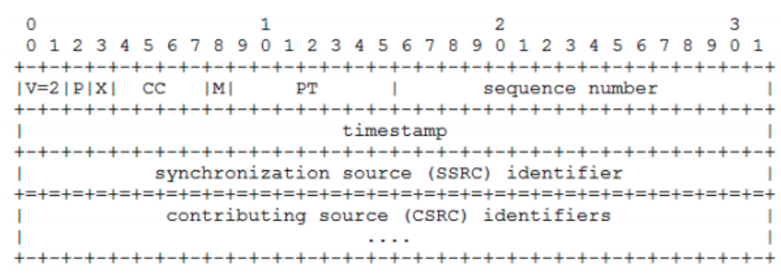
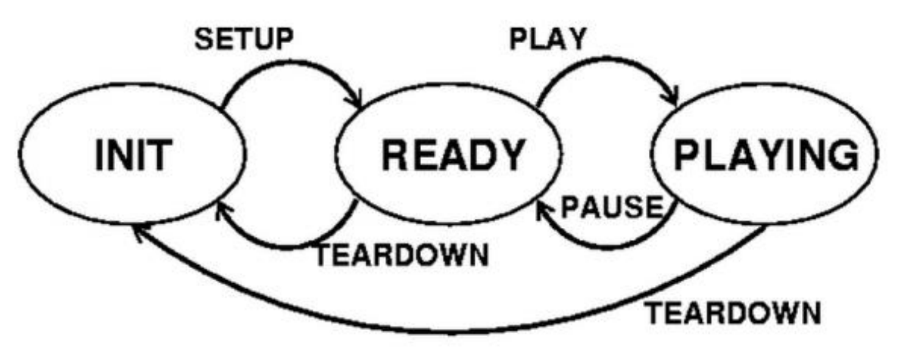

# RTP protocol headers

- version: 2 bits
- padding: 1 bit
- extension: 1 bit
- cc:  4 bits
- marker: 1 bit
- payload type: 7 bits
- sequence number: 16 bits
- timestamp: 32 bits

# Send RTSP request `sendRtspRequest`

Based on the state diagram to set up the guard conditions
for sending a variety of Request codes
- SETUP request <=> self.state = INIT
- PLAY request <=> self.state = READY
- PAUSE request <=> self.state = PLAYING
- TEARDOWN request <=> self.state in [READY, PLAYING]
- Otherwise, ignore the request

# User manual
- Running server: `python server.py 3000`
- Running client code `python ClientLauncher.py <serverIP> 3000 3001 movie.Mjpeg`